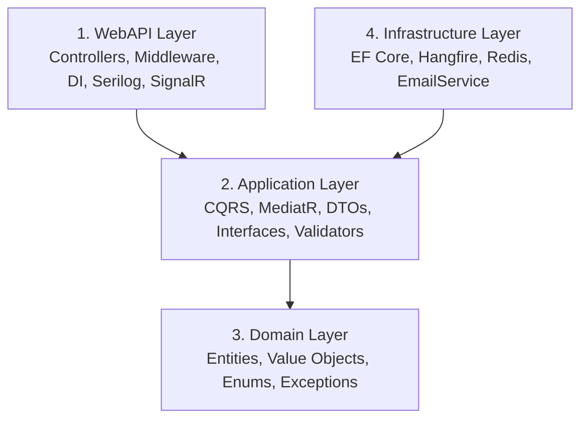

# 🛒 E-commerce Flash Sale System

Hệ thống thương mại điện tử chuyên dụng cho các sự kiện **Flash Sale** (Săn hàng giới hạn theo thời gian thực). Hệ thống giải quyết bài toán concurrency cao, xử lý hàng nghìn request đồng thời mà không xảy ra lỗi bán vượt tồn kho (overselling).

Đây là dự án cá nhân nhằm mục đích nghiên cứu và áp dụng các mô hình kiến trúc phần mềm, xử lý đồng thời, cũng như hoàn thiện kỹ năng Backend .NET.

---

## 🏗️ 1. Kiến trúc hệ thống (Clean Architecture 4 Layer)

Dự án áp dụng **Clean Architecture** với 4 layer rõ ràng, phân tách trách nhiệm chặt chẽ:



---

## ⚙️ 2. Áp dụng CQRS (Command Query Responsibility Segregation)

Hệ thống được chia thành 3 nhóm xử lý chính theo mô hình CQRS sử dụng **MediatR**:

1. **Commands (Ghi dữ liệu):** Xử lý các tác vụ làm thay đổi trạng thái hệ thống như đặt hàng (PlaceOrder), xác nhận thanh toán (ConfirmPayment). Được đóng gói chặt chẽ, sử dụng UnitOfWork và Repository pattern.
2. **Queries (Đọc dữ liệu):** Sử dụng `AsNoTracking()` của Entity Framework Core, hoặc Dapper (nếu cần tối ưu thêm), trả về các DTO nhỏ nhẹ trực tiếp qua Repository để tăng tốc độ phản hồi.
3. **Domain Events & Integration Events:** Sử dụng MediatR Notification để thực thi các tác vụ bất đồng bộ nội bộ (như gửi email, push SignalR) ngay sau khi ghi DB thành công.
4. **Pipeline Behaviors:** Tận dụng `IPipelineBehavior` của MediatR để xử lý các Cross-Cutting Concerns (các khía cạnh cắt ngang) một cách tập trung, bao gồm:
   - **ValidationBehavior:** Tự động kiểm tra tính hợp lệ của dữ liệu đầu vào (bằng FluentValidation) trước khi request chạm đến Handler.
   - **LoggingBehavior / PerformanceBehavior:** Tự động ghi log thời gian thực thi và payload của từng request, giúp dễ dàng debug và phát hiện bottleneck.

*Lý do áp dụng CQRS & MediatR:*
- Chia tách luồng Đọc/Ghi, cho phép tối ưu riêng rẽ (Read thường nhiều hơn Write).
- Tránh làm cồng kềnh các Service truyền thống. Mỗi Command/Query là một file Handler riêng lẻ, tuân thủ nguyên tắc SRP (Single Responsibility Principle).
- Dễ dàng gắn thêm Middleware (Pipeline Behavior) cho mọi request mà không phải sửa lại code cũ.

---

## 🛡️ 3. Kỹ thuật chống Overselling (Bán vượt quá tồn kho)

Trong các sự kiện Flash Sale, hàng chục nghìn người cùng mua một lượng sản phẩm nhỏ (ví dụ 100 cái). Nếu chỉ kiểm tra bằng EF Core thông thường, sẽ xảy ra Race Condition dẫn đến xuất kho âm. Hệ thống này sử dụng cơ chế bảo vệ 2 lớp:

1. **Lớp 1: Redis Lua Script (Atomic Operations)**
   - Hệ thống lưu trữ số lượng tồn kho trên Redis.
   - Khi có request đặt hàng, Redis sử dụng lệnh `DECR` (giảm atomic) thông qua script Lua để đảm bảo mỗi item được trừ chính xác, không bị can thiệp bởi thread khác.
   - Nếu tồn kho trên Redis < 0, request lập tức bị từ chối trước khi chạm vào Database.

2. **Lớp 2: Optimistic Concurrency Control (RowVersion trong SQL Server)**
   - Đảm bảo tính toàn vẹn dữ liệu gốc khi thực hiện ghi `SoldCount` vào bảng `FlashSaleItems`.
   - Bắt lỗi `DbUpdateConcurrencyException` nếu có 2 luồng cùng ghi và rollback an toàn.

**📊 Kết quả Test Tải (Load Testing với k6):**
> *[ĐANG CHỜ KẾT QUẢ TỪ BẠN ĐỂ ĐIỀN VÀO ĐÂY: VD: Chạy 1000 VU trong 1 phút, 5000 request xử lý thành công, số lượng bán ra chuẩn 100/100, Oversell = 0. Bạn hãy chạy k6 và thay thế placeholder này nhé]*

---

## 🚀 4. Hướng dẫn chạy dự án (Local)

### Yêu cầu môi trường
- .NET 8 SDK trở lên
- SQL Server (hoặc SQL Server Express)
- Redis Server (Chạy qua Docker hoặc Windows port 6379)

### Các bước cài đặt
1. **Clone repository:**
   ```bash
   git clone <repo-url>
   ```
2. **Cập nhật Connection String:**
   Mở `appsettings.Development.json` trong thư mục `ecommerce-flashsale-backend.WebAPI`, cấu hình lại chuỗi kết nối SQL Server và Redis.
   
3. **Chạy Entity Framework Migration:**
   ```bash
   dotnet ef database update -s ecommerce-flashsale-backend.WebAPI -p ecommerce-flashsale-backend.Infrastructure
   ```
   
4. **Chạy ứng dụng:**
   - Dùng lệnh `dotnet run --project ecommerce-flashsale-backend.WebAPI`
   - Data mẫu (Admin account, Categories, Products giả lập) sẽ được tự động **Seed** vào lần chạy đầu tiên.
   - Truy cập Swagger UI tại `https://localhost:<port>/swagger` (hoặc `/health` để xem trạng thái).

---

## 🌐 5. Danh sách API chính (Endpoints)

Hệ thống chia nhóm (Tags) rõ ràng trên Swagger:
- `Auth`: Đăng nhập, đăng ký, lấy Refresh Token.
- `Catalog`: API công khai xem danh sách sản phẩm, chi tiết sản phẩm.
- `FlashSaleOrders`: Tham gia sự kiện Flash Sale, giữ chỗ đơn hàng (Redis atomic).
- `Cart` & `Orders`: Mua hàng thông thường.
- `Payments`: Tích hợp VNPay/MoMo (tạo URL, xử lý Webhook Callback).
- `Admin`: API quản trị cho Category, Product, Banner và Flash Sale Campaigns.
- `Dashboard`: Query thống kê báo cáo lượt mua, doanh thu, lượt xem.

Ngoài ra hệ thống còn tích hợp:
- **Rate Limiting:** Chống Spam/DDoS các endpoint nhạy cảm (như nút Đặt hàng).
- **Health Checks:** Giám sát trạng thái SQL Server và Redis (`/health`).
